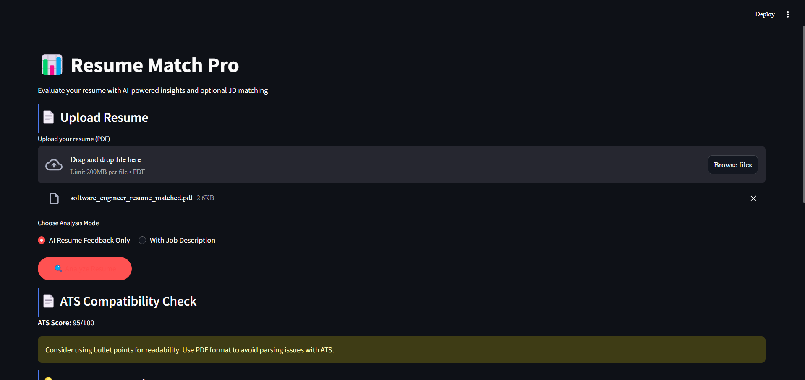
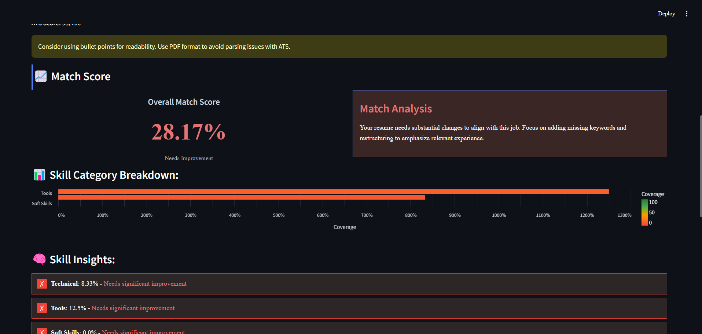
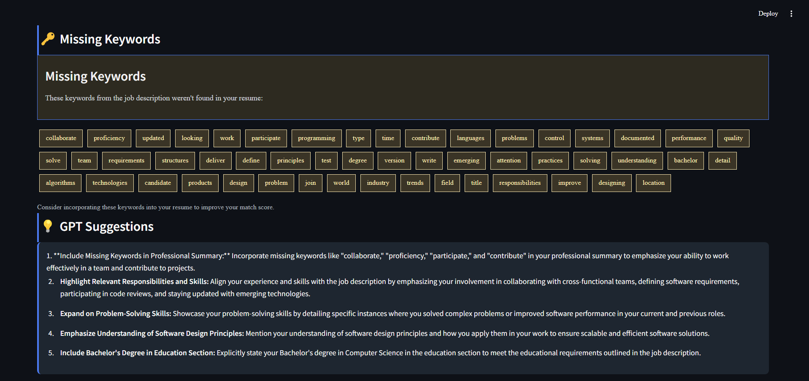

# Resume Match Pro

> AI-Powered Resume Evaluator with ATS Compliance & JD Matching

## 🔍 Overview
**Resume Match Pro** is a smart resume evaluation app built with **Streamlit** that:
- Extracts content from your **PDF resume**
- Analyzes alignment with a provided **Job Description (JD)**
- Performs **ATS compatibility checks** (formatting, sections, length, etc.)
- Provides **AI-driven suggestions** using OpenAI's GPT for improving the resume
- Supports **interactive Q&A** to help you further improve your resume

## 🚀 Features
- 📄 Upload resume (PDF only)
- 💼 Optional JD input for match scoring
- 🤖 GPT-powered resume critique
- ✅ ATS compliance scoring and feedback
- 🧠 Skill category breakdown & keyword gaps
- 💬 Chatbot to ask resume-related follow-up questions
- 🎨 Professionally styled UI with Times New Roman theme

## 🛠️ Tech Stack
- `Python 3.10+`
- `Streamlit`
- `OpenAI GPT (gpt-3.5-turbo)`
- `PyMuPDF` for PDF parsing
- `spaCy` for keyword extraction
- `dotenv` for environment variable management
- `Altair` for visualizations

## 📦 Installation
```bash
# Clone this repo
$ git clone https://github.com/yourusername/resume-match-pro.git
$ cd resume-match-pro

# (Optional) Create virtual environment
$ python -m venv venv
$ source venv/bin/activate  # or venv\Scripts\activate on Windows

# Install requirements
$ pip install -r requirements.txt
```

## 🔑 Environment Setup
Create a `.env` file in the root directory with your OpenAI API key:
```
OPENAI_API_KEY=your_openai_key_here
```

## 🚦 Run the App
```bash
streamlit run app.py
```

## 📁 Folder Structure
```
resume-match-pro/
├── app.py                  # Main Streamlit app
├── requirements.txt        # Dependencies
├── .env                    # API keys
├── utils/                  # Modular helper functions
│   ├── resume_parser.py
│   ├── jd_parser.py
│   ├── keyword_extractor.py
│   ├── match_scorer.py
│   ├── ats_checker.py
│   ├── gpt_feedback.py
│   └── display_helpers.py
```

## 📷 Screenshots








## 📜 License
MIT License

---
Made with ❤️ using Streamlit + GPT-3.5
